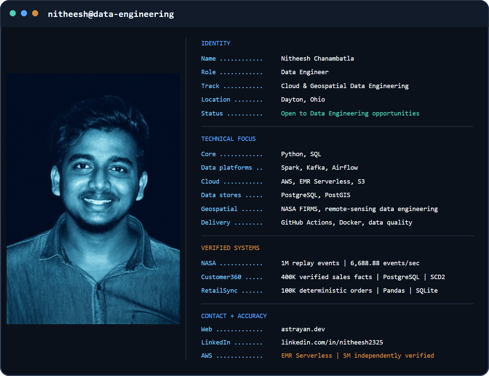

# Nitheesh Chanambatla

<picture>
  <source media="(prefers-color-scheme: dark) and (max-width: 600px)" srcset="assets/profile-dark-mobile.png">
  <source media="(prefers-color-scheme: light) and (max-width: 600px)" srcset="assets/profile-light-mobile.png">
  <source media="(prefers-color-scheme: dark)" srcset="assets/profile-dark.png">
  <source media="(prefers-color-scheme: light)" srcset="assets/profile-light.png">
  
</picture>

I build data pipelines, analytical warehouses, validation systems, and
geospatial event-processing workflows with reproducible tests, explicit data
contracts, and measurable reconciliation.

## Featured systems

### [NASA Earth Observation Event Intelligence Platform](https://github.com/Nitheesh2325/nasa-earth-observation-event-platform) — Flagship

Independently designed geospatial data platform built on 10,000 real NASA FIRMS detections using Python, Kafka, Spark, Airflow, PostgreSQL/PostGIS, FastAPI, and AWS EMR Serverless.

Verified the complete local platform with 1M replay events and processed 5M replay events on AWS at 8,734.80 events/second—with zero rejects, zero duplicates, replay-neutral scientific aggregates, and independent checksum verification across 82 Silver/Gold files.

`Python` · `PySpark` · `Kafka` · `Airflow` · `PostGIS` · `FastAPI` · `AWS EMR Serverless` · `CloudFormation`

### [Customer360 Analytics Warehouse](https://github.com/Nitheesh2325/customer-360-analytics-warehouse) — Supporting

PostgreSQL dimensional warehouse with **400,000 verified sales facts**, customer
and product SCD Type 2 processing, surrogate-key resolution, validation and
quarantine, repeat-safe loading, and **20 executed analytical SQL queries**.
Automated tests and hosted CI passed.

Facts resolve the dimension version current at load time; event-time historical
attribution is not implemented.

### [RetailSync Data Platform](https://github.com/Nitheesh2325/retailsync-data-platform) — Supporting

Deterministic local **100,000-order** batch pipeline with Pandas validation,
rejected-record persistence, transactional SQLite snapshot replacement, rerun
reconciliation, three analytical SQL queries, charting, and logging. Six tests
passed; hosted CI uses a 1,000-row full-pipeline fixture.

Full-snapshot local batch processing—not incremental ingestion, CDC, streaming,
cloud orchestration, or production deployment.

## Technical toolkit

- **Languages:** Python, SQL, Java, Scala, Shell
- **Data platforms:** Apache Spark, Apache Kafka, Airflow, Pandas, Hadoop/HDFS/YARN, Hive, Presto, AWS Glue, Informatica
- **Streaming and CDC:** Kafka Connect, Debezium, Amazon Kinesis, Amazon Data Firehose
- **Cloud:** AWS EMR Serverless, S3, Glue Data Catalog, Athena, Lambda, Redshift, IAM, KMS, CloudFormation, CloudWatch
- **Databases and modelling:** PostgreSQL, PostGIS, SQLite, dimensional modelling, star and snowflake schemas, SCD Type 2
- **Reliability and delivery:** validation, reconciliation, idempotency, retries and recovery, quarantine, Git, Jenkins, GitHub Actions, Docker, ELK
- **Serving and visualization:** FastAPI, Streamlit
- **Web delivery:** JavaScript, HTML/CSS, Node.js, Vercel, Supabase, Zod, responsive accessibility, security headers

## Remote sensing training

Completed five NASA Applied Remote Sensing Training (ARSET) certificates of
completion covering remote-sensing fundamentals, hyperspectral data for land
and coastal systems, and sustainable Earth-science application development.

- **Fundamentals of Remote Sensing** — August 3, 2026
- **Hyperspectral Data for Land and Coastal Systems** — August 17, 2026
- **Developing Sustainable Earth Science Applications, Modules 1–3** — August 19, 2026

## Engineering principles

- Evidence before claims and measurable validation before scale statements
- Reproducible execution with explicit data contracts and rerun behavior
- Reconciliation and failure handling treated as part of the pipeline
- Honest limitations and tradeoffs documented beside the implementation

## Contact

- [ASTRAYAN.dev](https://astrayan.dev/)
- [LinkedIn](https://www.linkedin.com/in/nitheesh2325/)
- [nitheeshc2325@gmail.com](mailto:nitheeshc2325@gmail.com)
- Open to Data Engineering opportunities
