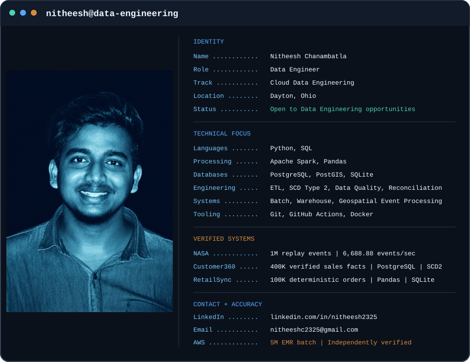

# Nitheesh Chanambatla

<picture>
  <source media="(prefers-color-scheme: dark)" srcset="assets/profile-dark.svg">
  <source media="(prefers-color-scheme: light)" srcset="assets/profile-light.svg">
  
</picture>

I build reproducible data pipelines, analytical warehouses, validation systems,
and geospatial event-processing workflows with reproducible tests, explicit
data contracts, and measurable reconciliation.

## Featured systems

### 1. [NASA Earth Observation Event Intelligence Platform](https://github.com/Nitheesh2325/nasa-earth-observation-event-platform) — Flagship

NASA FIRMS geospatial event-processing platform verified locally with
**1,000,000 replay events** using Spark and PostgreSQL/PostGIS, with measured
throughput of **6,688.88 events/second**.

AWS infrastructure is designed and locally validated, not deployed. A separate
10-million-event experiment verified deterministic generation and read-back;
Spark processing at that scale did not complete because of local JVM memory
limits. GitHub Actions passed.

### 2. [Customer360 Analytics Warehouse](https://github.com/Nitheesh2325/customer-360-analytics-warehouse) — Supporting

PostgreSQL dimensional warehouse with **400,000 verified sales facts**, customer
and product SCD Type 2 processing, surrogate-key resolution, validation and
quarantine, repeat-safe loading, and **20 executed analytical SQL queries**.
Automated tests and hosted CI passed.

Facts resolve the dimension version current at load time; event-time historical
attribution is not implemented.

### 3. [RetailSync Data Platform](https://github.com/Nitheesh2325/retailsync-data-platform) — Supporting

Deterministic local **100,000-order** batch pipeline with Pandas validation,
rejected-record persistence, transactional SQLite snapshot replacement, rerun
reconciliation, three analytical SQL queries, charting, and logging. Six tests
passed; hosted CI uses a 1,000-row full-pipeline fixture.

Full-snapshot local batch processing—not incremental ingestion, CDC, streaming,
cloud orchestration, or production deployment.

## Technical toolkit

- **Languages:** Python, SQL
- **Processing:** Apache Spark, Pandas
- **Databases:** PostgreSQL, PostGIS, SQLite
- **Data engineering:** ETL, dimensional modelling, SCD Type 2, validation, reconciliation, idempotency
- **Engineering tools:** Git, GitHub Actions, Docker
- **Cloud:** AWS infrastructure design and local validation

## Engineering principles

- Evidence before claims and measurable validation before scale statements
- Reproducible execution with explicit data contracts and rerun behavior
- Reconciliation and failure handling treated as part of the pipeline
- Honest limitations and tradeoffs documented beside the implementation

## Contact

- [LinkedIn](https://www.linkedin.com/in/nitheesh2325/)
- [nitheeshc2325@gmail.com](mailto:nitheeshc2325@gmail.com)
- Open to Data Engineering opportunities
